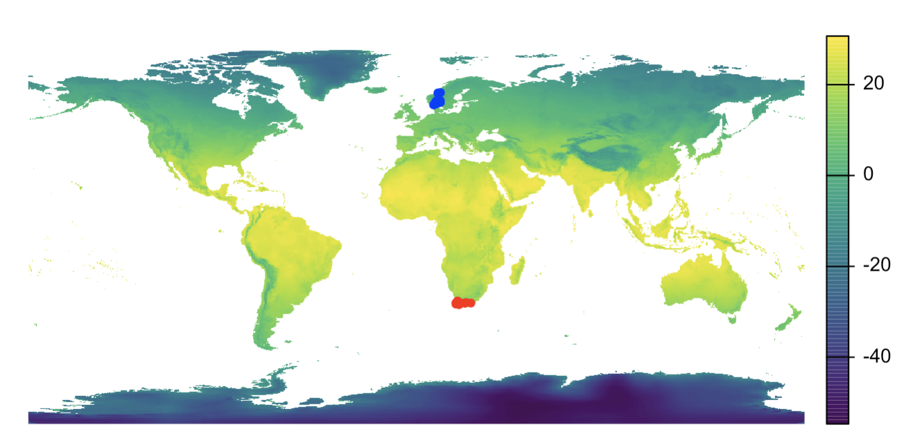
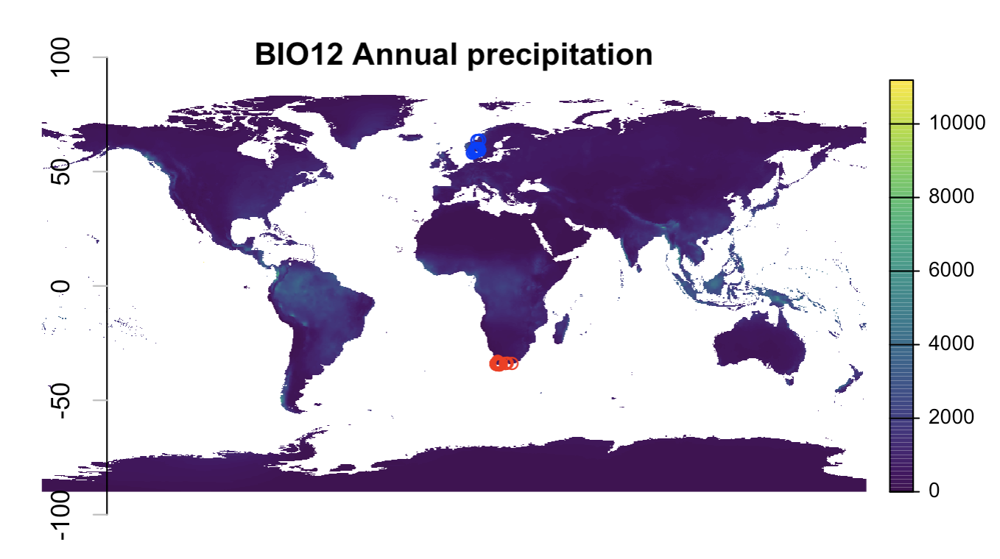
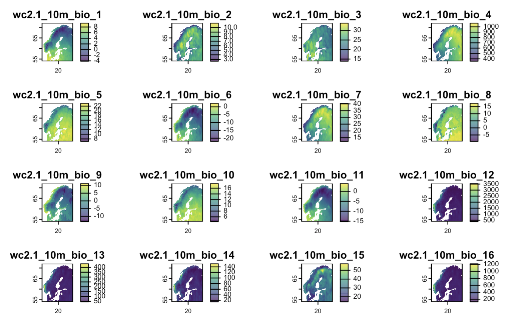
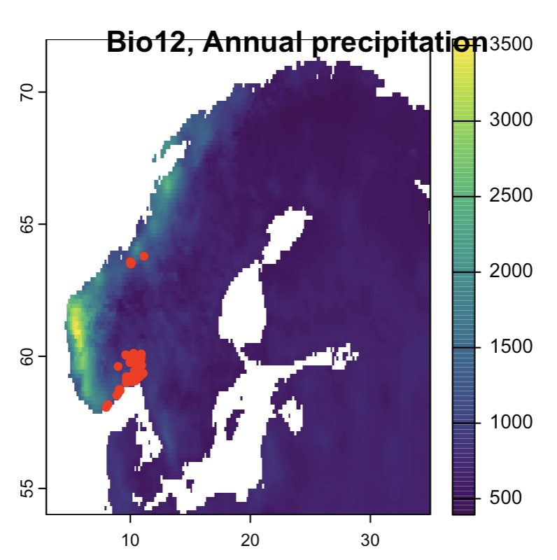

<!-- mapping_environment.html is generated from mapping_environment.Rmd. Please edit that file -->
***

This session focuses on linking GBIF data with environment layers, using modern spatial packages (`sf` for vector, `terra` for raster).

***

## Read example species occurrence data into R
See the gbif_intro script for downloading new species occurrences from GBIF


``` r
sp_ZA <- utils::read.delim("./environment/sp_ZA.txt", header=TRUE, dec=".", stringsAsFactors=FALSE) ## read file
sp_NO <- utils::read.delim("./environment/sp_NO.txt", header=TRUE, dec=".", stringsAsFactors=FALSE) ## read file
#head(sp_ZA, n=5) ## preview first 5 records
xy_NO <- sp_NO[c("decimalLongitude","decimalLatitude")] ## Extract coordinates
xy_ZA <- sp_ZA[c("decimalLongitude","decimalLatitude")] ## Extract coordinates
#sp_N O_m <- sp_NO[c("name", "catalogNumber", "decimalLongitude","decimalLatitude", "basisOfRecord", "year", "stateProvince", "taxonKey", "occurrenceID")] ## Subset columns (for more useful map pop-up)
#sp_ZA_m <- sp_ZA[c("name", "catalogNumber", "decimalLongitude","decimalLatitude", "basisOfRecord", "year", "stateProvince", "taxonKey", "occurrenceID")] ## Subset columns (for more useful map pop-up)
```

***

# Environment layers (WorldClim)

## Read environment layer from WorldClim into R
For more information about WorldClim see the referenced below.


``` r
require(geodata)
require(terra)
env <- worldclim_global(var='bio', res=10, path='./') # SpatRaster with 19 BIO layers
```

## Plot environment layers and species occurrences on a map


``` r
plot(env[[1]], main="BIO1 Mean monthly temperature", axes=FALSE) # plot bioclim layer
#plot(env, 1, main="WorldClim BioClim") ## add title with main="Title"
##title(main = bquote(italic(.(sp_name)) ~occurrences~on~Annual~mean~temperature~'(dCx10)'))
#plot(gadm_norway, add=TRUE) ## add admin county borders
points(xy_NO, col='blue', pch=20) # plot NO species occurrence points to the map
points(xy_ZA, col='red', pch=20) # plot ZA species occurrence points to the map
```




``` r
plot(env[[12]], main="BIO12 Annual precipitation", axes=FALSE) # plot bioclim layer, BIO12 = Annual Precipitation
#title(main = bquote(italic(.(sp_name)) ~occurrences~plotted~on~Annual~precipitation~'(mm)'))
axis(side=2, tck = -0.04, col.ticks="gray") ## add axis only left
points(xy_NO, col='blue') # plot species occurrence points to the map
points(xy_ZA, col='red') # plot species occurrence points to the map
```


***

## Print the plot to a local file


***

# Crop and mask raster layers
Cutting large (global) environment layers to a smaller extent can save significant memory. If your species occurrence data are limited to a region (e.g. Norway, Scandinavia or similar) you might reduce computation time significantly by cropping your environment layers appropriatly.

## Cut environment layer(s) to extent (result is always a square)

``` r
library(terra)
ext <- ext(3,35,54,72) ## minLon=3, maxLon=35, minLat=54, MaxLat=72 for Scandinavia
env_cut <- crop(env, ext, snap="out") ## square output
#env_cut <- crop(env, ext, filename="./demo_data/env_cut.tif", overwrite=TRUE)
plot(env_cut)
```


## Cut environment layer(s) to a mask (from a shapefile or other vector data)
NB! Mask is now desfunct -- need a new source for country mask vector -- TODO

``` r
library(geodata)
library(terra)
gadm_NO_0 <- gadm('NOR', level=0, path="./data/gadm/", resolution=2) ## sf object by default
mask <- vect(gadm_NO_0) ## convert to SpatVector for terra
env_crop <- crop(env, mask) ## cut to the extent of the mask
env_mask <- mask(env_crop, mask) ## mask removes data outside the mask
plot(env_mask)
lines(mask, lwd=2)
```


***

## Plot with extent Scandinavia (using zoom)
Using zoom, the raster data in R workspace environment is still the same size. You only zoom into the region of interest for more useful maps.

``` r
library(terra)
ext <- ext(3,35,54,72)
plot(crop(env[[12]], ext)); title(main="Bio12, Annual precipitation")
points(xy_NO, col='red', pch=20)
```


***

## Map of the cropped and masked raster layers

``` r
par(mfrow=c(1,2))
plot(env_crop$bio12); title(main="Bio12 cropped to Norway")
points(xy_NO, col='blue', pch=20)
plot(env_mask$bio12); title(main="Bio12 masked to Norway")
points(xy_NO, col='blue', pch=20)
```


***

### Extract climate data for species occurrence points

``` r
library(terra)
xy_vect <- vect(xy_ZA, geom = c("decimalLongitude","decimalLatitude"), crs = "EPSG:4326")
xy_bio <- terra::extract(env, xy_vect)
head(xy_bio, n=5)
write.table(xy_bio, file="./environment/xy_bio.txt", sep="\t", row.names=FALSE, col.names=TRUE, qmethod="double")
#xy_bio <- read.delim("./environment/xy_bio.txt", header=TRUE, dec=".", stringsAsFactors=FALSE)
```


``` r
sp_bio <- cbind(sp_ZA, xy_bio) # generating output file
head(sp_m_bio, n=5) ## preview first 5 records
write.table(sp_bio, file="./environment/sp_bio.txt", sep="\t", row.names=FALSE, col.names=TRUE, qmethod="double")
#sp_bio <- read.delim("./environment/sp_bio.txt", header=TRUE, dec=".", stringsAsFactors=FALSE) ## dataframe
```


***

## Size of environment layer can be LARGE if using the finer resolutions


``` r
## object.size(env) ## read the space allocated in memory for an environment variable
## format(object.size(env), units = "auto") ## Auto reports multiples of 1024
## format(object.size(env), units = "auto", standard = "SI") ## SI use multiples of 1000
cat("Size of env =", format(object.size(env), units = "auto"))
cat("\nSize of env_cut =", format(object.size(env_cut), units = "auto"))
#cat("\nSize of env_mask =", format(object.size(env_mask), units = "auto"))
#cat("\nSize of gadm_norway_1 =", format(object.size(gadm_norway_1), units = "auto"))
#rm(env) ## save memory - especially useful if using finer resolutions
```

 * Size of env =            235.5 Kb
 * Size of env_cut =         13.7 Kb
 * Size of env_mask =       940.8 Kb
 * Size of gadm_norway_1 =   12.8 Mb

***

## The BioClim layers:

 * BIO1 = Annual Mean Temperature (degree C multiplied by 10, to avoid decimal point)
 * BIO2 = Mean Diurnal Range (Mean of monthly (max temp – min temp)) 
 * BIO3 = Isothermality (BIO2/BIO7) (* 100)
 * BIO4 = Temperature Seasonality (standard deviation *100)
 * BIO5 = Max Temperature of Warmest Month
 * BIO6 = Min Temperature of Coldest Month
 * BIO7 = Temperature Annual Range (BIO5-BIO6)
 * BIO8 = Mean Temperature of Wettest Quarter
 * BIO9 = Mean Temperature of Driest Quarter
 * BIO10 = Mean Temperature of Warmest Quarter 
 * BIO11 = Mean Temperature of Coldest Quarter 
 * BIO12 = Annual Precipitation (mm)
 * BIO13 = Precipitation of Wettest Month (mm)
 * BIO14 = Precipitation of Driest Month (mm)
 * BIO15 = Precipitation Seasonality (Coe cient of Variation) 
 * BIO16 = Precipitation of Wettest Quarter
 * BIO17 = Precipitation of Driest Quarter
 * BIO18 = Precipitation of Warmest Quarter
 * BIO19 = Precipitation of Coldest Quarter

***

# Read environment layer from WorldClim into R
[Worldclim](http://worldclim.org/) information about the [bioclim variables](http://worldclim.org/bioclim).

*Citation, Worldclim version 2*: Fick, S.E. and R.J. Hijmans (2017) Worldclim 2: New 1-km spatial resolution climate surfaces for global land areas. *International Journal of Climatology* 37: 4302–4315. [DOI:10.1002/joc.5086](https://doi.org/10.1002/joc.5086).

*Citation, Worldclim version 1*: Hijmans, R.J., S.E. Cameron, J.L. Parra, P.G. Jones and A. Jarvis (2005) Very high resolution interpolated climate surfaces for global land areas. *International Journal of Climatology* 25: 1965-1978. [DOI:10.1002/joc.1276](https://doi.org/10.1002/joc.1276).

### Download and load bioclim layers from WorldClim
Data source worldclim requires variables "var", "res", and if res=0.5 also "lon" and "lat":

 * var = bio, tmin, tmax, tavg, prec, srad, wind, or vapr. [More information](http://worldclim.org/version2).
 * res = "10" minutes (ca 18.5km), "5" min (ca 9.3km), "2.5" min (ca 4.5km), "0.5" 30 arc-seconds (ca 1km)
 * lon = [longitude], lat = [latitude], as integer coordinate-values somewhere inside the tile that you want.

The tiled data comes in 30 x 30 degree tiles. Information about [download by tile](http://www.worldclim.org/tiles.php). More inforamtion about [data formats](http://www.worldclim.org/formats1).

**NB! finer resolution will cause very large Internet download, and cache large files locally!**

***


