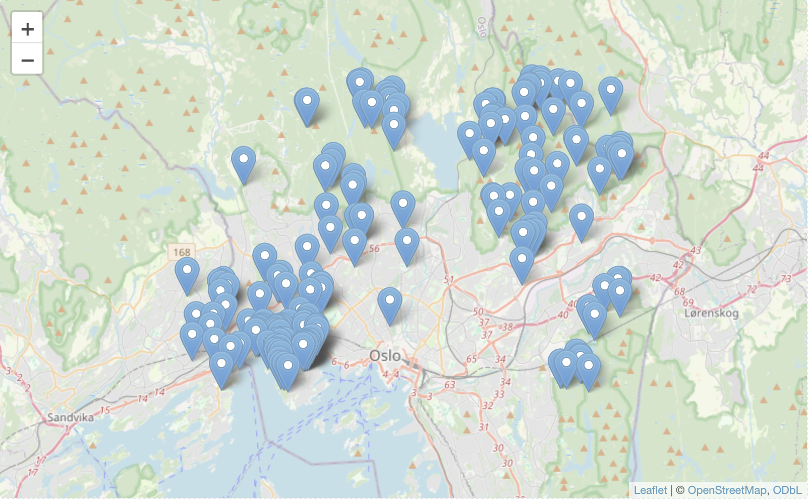

<!-- gbif_demo.html and gbif_demo.md are generated from gbif_demo.Rmd. Edit that file -->

***

This session includes examples of accessing GBIF data from R using the [rgbif](https://www.gbif.org/tool/81747/rgbif) [package](https://cran.r-project.org/web/packages/rgbif/index.html) from [rOpenSci](https://ropensci.org/)

***

## Choose a species name
```{r eval=FALSE}
require(rgbif) # r-package for GBIF data
sp_name <- "Hepatica nobilis"; kingdom <- "Plantae" # liverleaf (blaaveis:no), taxonKey=5371699
#sp_name <- "Hordeum vulgare"; kingdom <- "Plantae" # barley (bygg:no)
#sp_name <- "Pinus sylvestris L"; kingdom <- "Plantae" # scots pine (furu:no), taxonKey=5285637
#sp_name <- "Picea abies (L.) H. Karst"; kingdom <- "Plantae" # Norway spruce (gran:no), taxonKey=5284884
#sp_name <- "Juniperus communis L."; kingdom <- "Plantae" # common juniper (einer:no), taxonKey=2684709
#sp_name <- "Salmo trutta"; kingdom <- "Animalia" # trout (oerret:no)
#sp_name <- "Parus major Linnaeus"; kingdom <- "Animalia" # great tit (kjoettmeis:no), taxonKey=8095051
#sp_name <- "Cycladophora davisiana Ehrenberg"; kingdom <- "Chromista" # radiolaria sp., taxonKey=5955869
key <- name_backbone(name=sp_name, kingdom=kingdom)$speciesKey
```

## You may also use a higher level group (with a taxonKey)
```{r eval=FALSE}
nub <- 'd7dddbf4-2cf0-4f39-9b2a-bb099caae36c'; sp_name <- NULL # GBIF NUB taxon backbone datasetKey
#sp_name <- "Plantae";      rank <- "KINGDOM" # plants, taxonKey=6
#sp_name <- "Tracheophyta"; rank <- "PHYLUM"  # vascular plants, taxonKey=7707728
sp_name <- "Poaceae";      rank <- "FAMILY"  # grasses, taxonKey=3073
#sp_name <- "Aves";         rank <- "CLASS"   # birds, taxonKey=212
key <- name_lookup(query=sp_name, rank=rank, datasetKey=nub, limit=1)$data$key # find taxonKey
```
Choose a rank among: CLASS, CULTIVAR, CULTIVAR_GROUP, DOMAIN, FAMILY, FORM, GENUS, INFORMAL, INFRAGENERIC_NAME, INFRAORDER, INFRASPECIFIC_NAME, INFRASUBSPECIFIC_NAME, KINGDOM, ORDER, PHYLUM, SECTION, SERIES, SPECIES, STRAIN, SUBCLASS, SUBFAMILY, SUBFORM, SUBGENUS, SUBKINGDOM, SUBORDER, SUBPHYLUM, SUBSECTION, SUBSERIES, SUBSPECIES, SUBTRIBE, SUBVARIETY, SUPERCLASS, SUPERFAMILY, SUPERORDER, SUPERPHYLUM, SUPRAGENERIC_NAME, TRIBE, UNRANKED, VARIETY

## Species occurrence data from GBIF
```{r eval=FALSE}
require(rgbif) # r-package for GBIF data
sp <- occ_search(scientificName = "Hepatica nobilis", hasCoordinate = TRUE, limit = 100)
sp <- sp$data
```


## Request a GBIF occurrence download with DOI
The GBIF download API issues a DOI for every completed request, which students can cite directly in reports and manuscripts [@https://cran.r-project.org/web/packages/rgbif/refman/rgbif.html#occ_download]. Configure your GBIF credentials once (from your GBIF.org profile) and save them as environment variables (`GBIF_USER`, `GBIF_PWD`, `GBIF_EMAIL`) before running the chunk below.

Read more from https://docs.ropensci.org/rgbif/articles/gbif_credentials.html 


```{r eval=FALSE, message=FALSE}
library(rgbif)

# Sanity-check that the credentials are available in your R session
gbif_user  <- Sys.getenv("GBIF_USER")
gbif_pwd   <- Sys.getenv("GBIF_PWD")
gbif_email <- Sys.getenv("GBIF_EMAIL")
stopifnot(nzchar(gbif_user), nzchar(gbif_pwd), nzchar(gbif_email))

# Reuse the taxon key defined above (e.g., Hepatica nobilis)
download_key <- occ_download(
  pred("taxonKey", key),
  pred("country", "NO"),      # optional filters, here limit to Norway
  pred_gte("year", 2000),     # keep recent records
  format = "SIMPLE_CSV",
  user = gbif_user,
  pwd = gbif_pwd,
  email = gbif_email
)

# Wait for GBIF to finish preparing the dataset (polls every 10 seconds by default)
occ_download_wait(download_key, status_ping = 10, quiet = FALSE)

# Retrieve metadata, total record count, and the registered DOI
download_meta <- occ_download_meta(download_key)
download_doi  <- occ_download_doi(download_key)

download_meta$status         # should be "SUCCEEDED" when complete
download_meta$totalRecords   # number of occurrences packaged
download_doi                 # e.g. "10.15468/dl.xxxxxx"
sprintf("https://doi.org/%s", download_doi)    # handy shareable link

# Optional: grab a ready-to-use citation text for student reports
occ_download_citation(download_key)
```

The DOI remains permanently resolvable at `https://doi.org/<download_doi>` and lands on the GBIF download page where students (and reviewers) can access the occurrence archive, metadata, and recommended citation.

***

## Preview of dataframe with search results
```{r eval=FALSE}
head(sp, n=5) ## preview first 5 records
```


***

## Extract coordinates suitable for e.g. Maxent
```{r eval=FALSE}
xy <- sp[c("decimalLongitude","decimalLatitude")] ## Extract only the coordinates
sp_xy <- sp[c("species", "decimalLongitude","decimalLatitude")] ## Input format for Maxent
# structure(sp_xy) ## preview the list of coordinates
head(sp_xy, n=5) ## preview first 5 records
```


## Write dataframe to file (useful for Maxent etc.)
```{r messages=FALSE, eval=FALSE}
#write.table(sp_xy, file="./gbif_demo/sp_xy.txt", sep="\t", row.names=FALSE, qmethod="double") ## for Maxent
readLines("./gbif_demo/sp_xy.txt", n=10)
#readChar("./gbif_demo/sp_xy.txt", file.info("./gbif_demo/sp_xy.txt")$size) ## Alternative preview
```


## Read data file back into R
```{r eval=FALSE}
#rm(sp_xy) ## remove vector sp_xy from the R workspace environment, before re-loading
#sp_xy <- read.delim("./gbif_demo/sp_xy.txt", header=TRUE, dec=".", stringsAsFactors=FALSE)
#head(sp_xy, n=5) ## preview first 5 records
```

***

## GBIF data from Norway
```{r echo=FALSE, message=FALSE, eval=FALSE}
require(rgbif) # r-package for GBIF data
sp_no <- occ_search(taxonKey=key, hasCoordinate=TRUE, country="NO", limit=200)
sp_no <- sp_no$data
```


***

## GBIF data from Trondheim (or another bounding box)
```{r echo=FALSE, message=FALSE, eval=FALSE}
require(rgbif) # r-package for GBIF data
#bb <- c(31.5740,-25.0030,31.6080,-24.9815) # Skukuza Rest Camp, Kruger
#bb <- c(10.2,63.3,10.6,63.5) # Trondheim
#bb <- c(5.25, 60.3, 5.4, 60.4) # Bergen
#bb <- c(18.7, 69.6, 19.2, 69.8) # Tromsoe
bb <- c(10.6, 59.9, 10.9, 60.0) # Oslo
#sp_bb <- occ_search(taxonKey=key, return="data", hasCoordinate=TRUE, country="NO", geometry=bb, limit=200)
# `return` param in `occ_search` function is defunct as of rgbif v3.0.0
#sp_bb_m <- sp_bb[c("name", "catalogNumber", "decimalLongitude","decimalLatitude", "basisOfRecord", "year", "municipality", "taxonKey", "occurrenceID")] ## Subset columns
# --> testing to take out data myself
sp_bb <- occ_search(taxonKey=key, hasCoordinate=TRUE, country="NO", geometry=bb, limit=200)
sp_bb_data <- sp_bb$data
sp_bb_m <- sp_bb_data[c("name", "catalogNumber", "decimalLongitude","decimalLatitude", "basisOfRecord", "year", "municipality", "taxonKey", "occurrenceID")] ## Subset columns
```

## Preview data frame
```{r message=FALSE, eval=FALSE}
#head(sp_bb, n=5) ## preview first 5 records
head(sp_bb_m, n=5) ## preview first 5 records
```


## Mapping with the Leaflet package
```{r message=FALSE, eval=FALSE}
## ERROR mapr package deprecated
#library("mapr") # rOpenSci r-package for mapping (occurrence data) # archived 2023
#library("spocc") # rOpenSci r-package with more biodiversity data sources than GBIF
#map_leaflet(sp_bb_m, "decimalLongitude", "decimalLatitude", size=2, color="blue")
#sp_bb_L <- sp_bb_m
#names(sp_bb_L)[names(sp_bb_L) == "decimalLatitude"] <- "lat"
#names(sp_bb_L)[names(sp_bb_L) == "decimalLongitude"] <- "lng"
## map_leaflet() deprectaed --> leaflet()
## -->
library(leaflet) # lat lng
leaflet() %>% addTiles() %>% addMarkers(lng = sp_bb_m$decimalLongitude, lat = sp_bb_m$decimalLatitude, popup = sp_bb_m$name)
##
```



***

## Make a simple map of 4 spring flower species (in Norway) <-- ERROR
```{r message=FALSE, eval=FALSE}
## liverleaf, wood anemone, dandelion, red clover
spp_names <- c('Hepatica nobilis', 'Anemone nemorosa', 'Taraxacum officinale', 'Trifolium pratense')  
keys <- sapply(spp_names, function(x) name_backbone(name=x, kingdom='plants')$speciesKey, USE.NAMES=FALSE)
#spp <- occ_search(taxonKey=keys, limit=100, return='data', country='NO', hasCoordinate=TRUE)
## ERROR return param is defunct -- Need to extract data ourselves -- TODO
spp <- occ_search(taxonKey=keys, limit=100, country='NO', hasCoordinate=TRUE) ## return list
#spp <- occ_data(taxonKey=keys, limit=100, country='NO', hasCoordinate=TRUE) ## return list
library('plyr') ## r-pkg plyr for splitting, applying and combining data
###
### ERROR TODO looks at how the response data from occ_search() is different from previous
###
spp_df <- ldply(spp$data) ## ldply - split list, apply function, return dataframe (here list to df)
#gbifmap(spp_df, region='norway') ## Alternative simpler map
spp_m <- spp_df[c("name", "decimalLongitude","decimalLatitude", "basisOfRecord", "year", "municipality")]
cols <- c('blue', '#dddddd', 'yellow', 'red')
map_leaflet(spp_m, "decimalLongitude", "decimalLatitude", size=3, color=cols) ## map_leaflet deprecated --> leaflet 
###
### --> TODO
###
```


***
***

## Expand color-ramp when mapping many species
Notice that colors will not be easy to distinguish when number of species is high. Standard color-ramps include 9-12 colors.
```{r eval=FALSE}
## Poaceae has taxonKey=3073 - which gives us multiple species (here 31 unique "names", 33 unique "taxonKey")
bb_t <- c(10.2,63.3,10.6,63.5) ## Trondheim
#spp_t <- occ_search(taxonKey='3073', limit=100, return='data', country='NO', geometry=bb_t, hasCoordinate=TRUE) ## ERROR return param is defunct --> occ_data()
spp_t <- occ_data(taxonKey='3073', limit=100, country='NO', geometry=bb_t, hasCoordinate=TRUE)
spp_t_m <- spp_t$data[c("name", "decimalLongitude","decimalLatitude", "basisOfRecord", "year", "municipality", "taxonKey")]
```

## Plot on map
```{r message=FALSE, eval=FALSE}
## ERROR package mapr deprecated --> TODO update/fix color ramp function
## The default color-ramp (Set1) has 9 colors and cause a warning message when more than 9 species are included in the same map.
##library('mapr') # rOpenSci r-package for mapping (occurrence data) --> ERROR mapr deprectaed
##library('spocc') # rOpenSci r-package with more biodiversity data sources than GBIF --> ERROR deprecated
##library('plotly') --> ERROR plotly deprecated
library('RColorBrewer')
n_spp <- length(unique(spp_t_m$name)) # number of unique taxa in dataframe (USE spp$name, NOT spp$taxonKey)
myColors <- colorRampPalette(brewer.pal(11,"Spectral"))(n_spp) # create [n_spp] colors
#myColors <- colorRampPalette(brewer.pal(9,"Set1"))(n_spp) # create color palette with [n_spp] colors
#myColors <- rainbow(length(unique(spp_t_m$name))) # create color palette with [n_spp] colors
#map_leaflet(spp_t_m, "decimalLongitude", "decimalLatitude", size=5, color=myColors) ## ERROR map_leaflet deprecated
leaflet() %>% addTiles() %>% addMarkers(lng = spp_t_m$decimalLongitude, lat = spp_t_m$decimalLatitude)
```


## Diverse color palettes
```{r eval=FALSE}
library(RColorBrewer)
#display.brewer.all()
display.brewer.pal(n=9, name='Set1')
```


Read more about colors at the [https://www.r-bloggers.com/palettes-in-r/](R-bloggers story about color palettes in R)

***
## Further reading

* [GBIF data use course - rgbif](https://techdocs.gbif.org/en/data-use/rgbif)
* [Introduction to rgbif (2021)](https://docs.ropensci.org/rgbif/articles/rgbif.html)
* [Getting Occurrence Data From GBIF](https://docs.ropensci.org/rgbif/articles/getting_occurrence_data.html)
* [Working With Taxonomic Names](https://docs.ropensci.org/rgbif/articles/taxonomic_names.html)
* [Nordic Oikos 2018 workshop GitHub](https://github.com/GBIF-Europe/nordic_oikos_2018_r) and [GitHub.io html](https://gbif-europe.github.io/nordic_oikos_2018_r/) pages.


