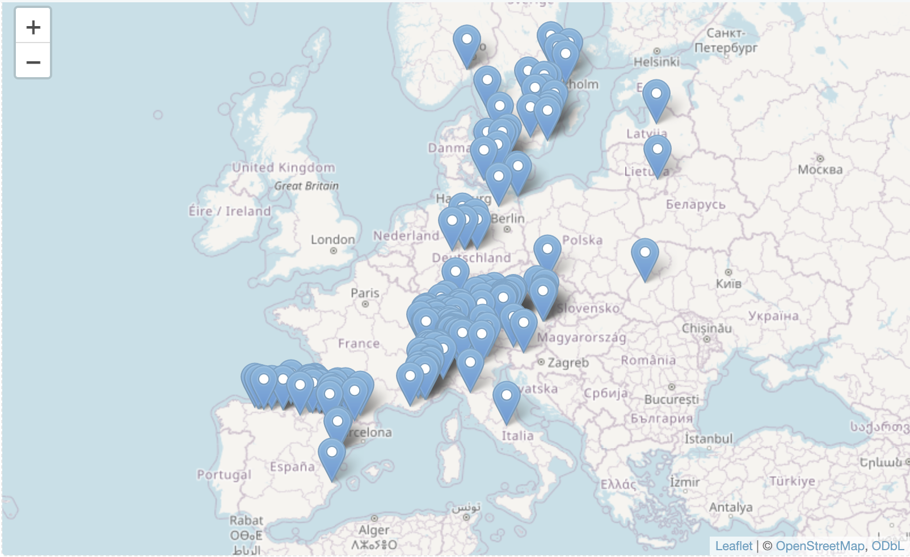

<!-- gbif_intro.html is generated from gbif_intro.Rmd. Please edit that file -->

This session includes examples of **accessing GBIF data from R** using the [rgbif](https://www.gbif.org/tool/81747/rgbif) [package](https://cran.r-project.org/web/packages/rgbif/index.html) from [rOpenSci](https://ropensci.org/).

***

## Choosing a species name

``` r
require(rgbif) # r-package for GBIF data
sp_name <- "Hepatica nobilis" # liverleaf (blaaveis:no)
key <- name_backbone(name=sp_name, kingdom="Plantae")$speciesKey
```

## Retrieve GBIF species occurrence data

``` r
require(rgbif) # r-package for GBIF data
key <- name_backbone(name="Hepatica nobilis", kingdom="Plantae")$speciesKey
sp <- occ_search(taxonKey=key, hasCoordinate=TRUE, limit=200)
sp <- sp$data  ## extract the data frame
```

<!-- Warning: `return` param in `occ_search` function is defunct as of rgbif v3.0.0, and is ignored - thus need to call the data with dataframe$data -->


## Plot occurrences on a map

``` r
require('rgbif')   # rOpenSci r-package for GBIF data
require('leaflet') # r-package to plot the Leaflet map
#key <- rgbif::name_backbone(name="Aegilops geniculata", kingdom="Plantae")$speciesKey
#sp <- rgbif::occ_search(taxonKey=key, hasCoordinate=TRUE, limit=200, stateProvince = "Apulia")
key <- rgbif::name_backbone(name="Aurelia solida", kingdom="Animalia")$speciesKey
sp <- rgbif::occ_search(taxonKey=key, hasCoordinate=TRUE, limit=250)
sp <- sp$data
leaflet() %>% addTiles() %>% addMarkers(lng = sp$decimalLongitude, lat = sp$decimalLatitude)
```



## Retrieve GBIF species occurrence data with a bounding box
Species is *Hepatica nobilis* with taxonKey **5371699**

``` r
require('rgbif') # r-package for GBIF data
bbox <- c(10.2,63.3,10.6,63.5) # Trondheim
#bbox <- c(31.5740,-25.0030,31.6080,-24.9815) # Skukuza Rest Camp, Kruger
sp_bb <- occ_search(taxonKey=key, hasCoordinate=TRUE, country="NO", geometry=bbox, limit=200)
sp_bb <- sp_bb$data
leaflet() %>% addTiles() %>% addMarkers(lng = sp_bb$decimalLongitude, lat = sp_bb$decimalLatitude)
```


### Extract coordinates suitable for SDM with e.g. Maxent

``` r
xy <- sp[c("decimalLongitude","decimalLatitude")] ## Extract only the coordinates
sp_xy <- sp[c("species", "decimalLongitude","decimalLatitude")] ## Input format for Maxent
head(sp_xy, n=5) ## preview first 5 records
```

### Write dataframe to file (useful for Maxent etc)

``` r
write.table(sp_xy, file="./gbif_intro/sp_xy.txt", sep="\t", row.names=FALSE, qmethod="double") ## for Maxent
```

### Read data file back into R

``` r
sp_xy <- read.delim("./gbif_intro/sp_xy.txt", header=TRUE, dec=".", stringsAsFactors=FALSE)
```

***
GBIF demo examples for species: *Hepatica nobilis* (taxonKey:5371699).

***

