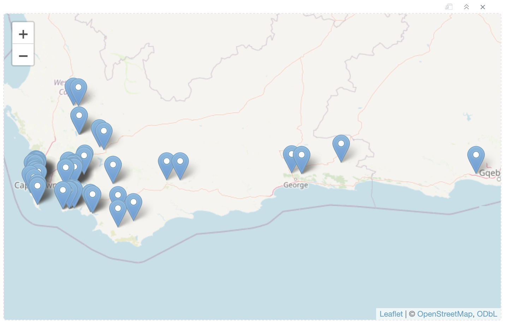
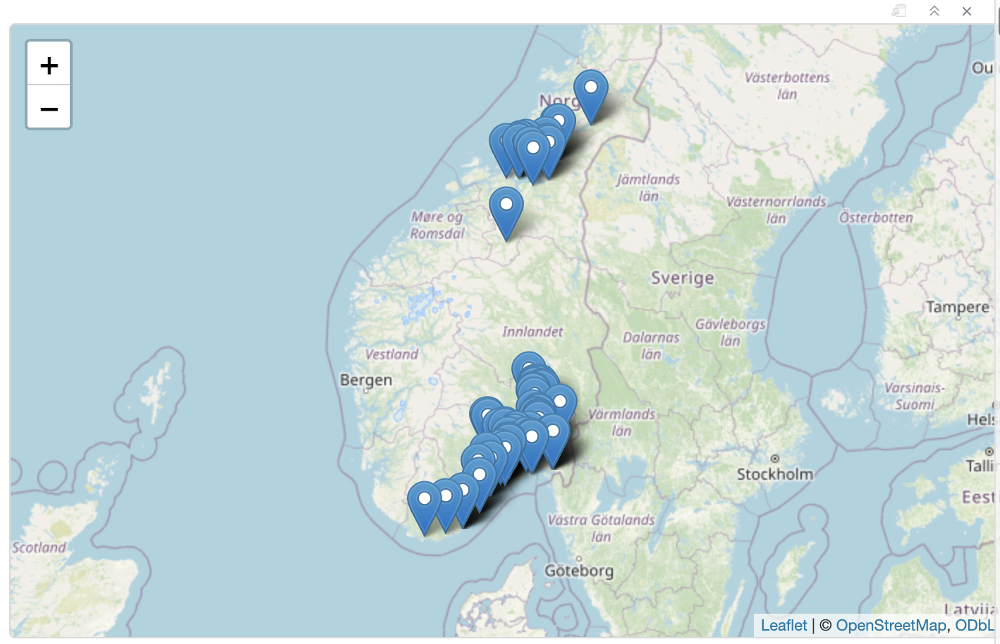
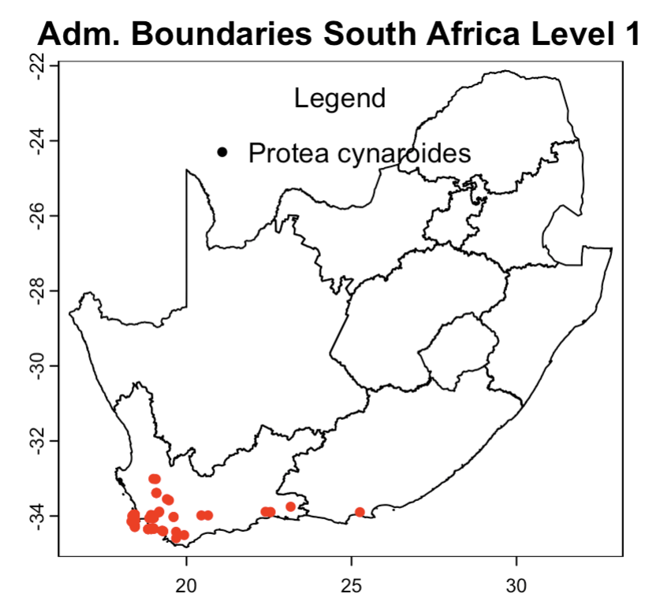
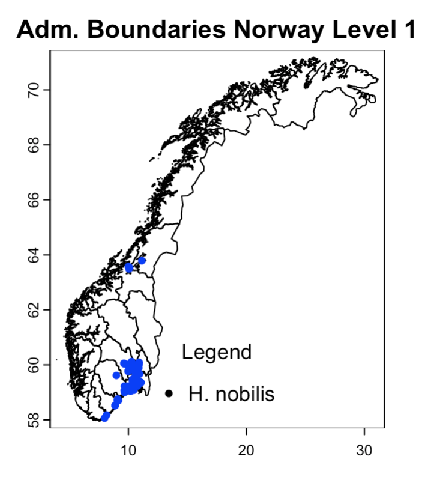
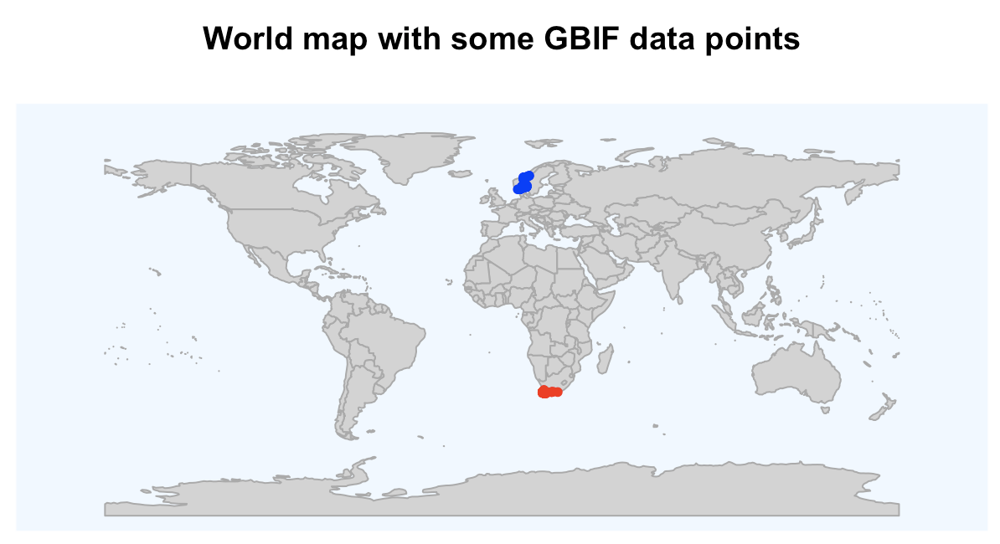
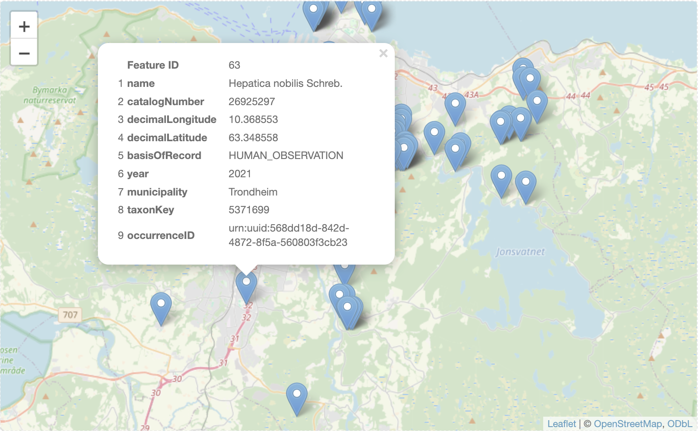

<!-- mapping.html is generated from mapping.Rmd. Please edit that file -->

***

You are here: [R workshop](./index.html) >> **mapping demo**

***

# GBIF data access using R: Mapping demo

This session focuses on working with environment layers, mapping, cropping and masking layers using modern spatial packages (`sf` for vector, `terra` for raster). See also the [Biostats making maps with R](https://biostats-r.github.io/biostats/workingInR/140_maps.html) training resource.

***

## GBIF data for king protea (Protea cynaroides) from South Africa
```{r eval=FALSE}
require('rgbif') # rOpenSci r-package for GBIF data
library('leaflet') # package to plot the Leaflet map
sp_name <- "Protea cynaroides"; kingdom <- "Plantae" # king protea, taxonKey=5637947
key <- rgbif::name_backbone(name=sp_name, kingdom=kingdom)$speciesKey
sp <- rgbif::occ_search(taxonKey=key, hasCoordinate=TRUE, country="ZA", limit=100)
sp_ZA = sp$data ### extracting the data table from the data frame
sp_ZA_m <- sp$data[c("name", "catalogNumber", "decimalLongitude","decimalLatitude", "basisOfRecord", "year", "stateProvince", "taxonKey", "occurrenceID")] ## Subset columns (for more useful map pop-up)
xy_ZA <- sp$data[c("decimalLongitude","decimalLatitude")] ## Extract coordinates
sp_ZA_xy <- sp$data[c("species", "decimalLongitude","decimalLatitude")] ## Input format for Maxent
leaflet() %>% addTiles() %>% addMarkers(lng = sp_ZA$decimalLongitude, lat = sp_ZA$decimalLatitude)
```


***

## GBIF data for liverleaf (bl&aring;veis:no) from Norway
```{r eval=FALSE}
library('rgbif') # rOpenSci r-package for GBIF data
#library('mapr') # rOpenSci r-package for mapping (occurrence data) ## ERROR mapr deprecated
library('leaflet') # package to plot the Leaflet map
sp_name <- "Hepatica nobilis"; kingdom <- "Plantae" # liverleaf (blaaveis:no), taxonKey=5371699
key <- rgbif::name_backbone(name=sp_name, kingdom=kingdom)$speciesKey
sp <- rgbif::occ_search(taxonKey=key, hasCoordinate=TRUE, country="NO", limit=100)
sp_NO <- sp$data
sp_NO_m <- sp$data[c("name", "catalogNumber", "decimalLongitude","decimalLatitude", "basisOfRecord", "year", "municipality", "taxonKey", "occurrenceID")] ## Subset columns (for more useful map pop-up)
xy_NO <- sp$data[c("decimalLongitude","decimalLatitude")] ## Extract only the coordinates
sp_NO_xy <- sp$data[c("species", "decimalLongitude","decimalLatitude")] ## Input format for Maxent
### rgbif::gbifmap(sp, region = "norway") ### defunct gbifmap deprectated March 2023
### mapr::map_leaflet(sp_m, "decimalLongitude", "decimalLatitude", size=2, color="blue") ### defunct mapr deprectated March 2023
leaflet() %>% addTiles() %>% addMarkers(lng = sp_NO$decimalLongitude, lat = sp_NO$decimalLatitude)
```


***

## Extract coordinates suitable for e.g. Maxent
```{r eval=FALSE}
library('utils')
xy <- sp$data[c("decimalLongitude","decimalLatitude")] ## Extract only the coordinates
sp_xy <- sp$data[c("species", "decimalLongitude","decimalLatitude")] ## Input format for Maxent
#utils::write.table(sp_xy, file="./mapping/sp_xy.txt", sep="\t", row.names=FALSE, qmethod="double")
#readLines("./mapping/sp_xy.txt", n=10)
```

## Write example species occurrence data from R to file
```{r eval=FALSE}
#head(sp_ZA, n=5) ## preview first 5 records
utils::write.table(sp_NO, file="./mapping/sp_NO.txt", sep="\t", row.names=FALSE, qmethod="double") ## write to file
utils::write.table(sp_ZA, file="./mapping/sp_ZA.txt", sep="\t", row.names=FALSE, qmethod="double") ## write to file
## Extract coordinates
xy_NO <- sp_NO[c("decimalLongitude","decimalLatitude")] ## Extract coordinates
xy_ZA <- sp_ZA[c("decimalLongitude","decimalLatitude")] ## Extract coordinates
```

## Read example species occurrence data into R
```{r eval=FALSE}
sp_ZA <- utils::read.delim("./mapping/sp_ZA.txt", header=TRUE, dec=".", stringsAsFactors=FALSE) ## read from file
xy_ZA <- sp_ZA[c("decimalLongitude","decimalLatitude")] ## Extract coordinates
sp_NO <- utils::read.delim("./mapping/sp_NO.txt", header=TRUE, dec=".", stringsAsFactors=FALSE) ## read from file
head(sp_ZA, n=5) ## preview first 5 records
```

***

## Administrative borders for South Africa from GADM
```{r eval=FALSE}
#install.packages("geodata")
library(geodata)
gadm_ZA_2 <- gadm('ZAF', level=2, path="./data/gadm", resolution=2) ## level 0,1,2,...
plot(gadm_ZA_2, main="Adm. Boundaries South Africa Level 1")
points(xy_ZA, col='red', pch=20) ## plot species occurrence points to the map (smaller dots)
legend("top", title = "Legend", legend = "Protea cynaroides", pch = 20, pt.bg = "red", bty = "n")
```


## Get administrative borders for Norway from GADM
Slow to render, many details for the coast...
```{r eval=FALSE}
#install.packages("geodata")
library(geodata)
gadm_NO_1 <- gadm('NOR', level=1, path="./data/gadm/", resolution=2) ## level 0,1,2,...
plot(gadm_NO_1, main="Adm. Boundaries Norway Level 1")
points(xy_NO, col='blue', pch=20) ## plot species occurrence points to the map (smaller dots)
legend("bottom", title = "Legend", legend = "H. nobilis", pch = 20, pt.bg = "blue", bty = "n")
```



***
***

## Get world map from rworldmap

```{r message=FALSE, eval=FALSE}
#install.packages("rworldmap")
library(rworldmap)
worldmap <- getMap(resolution = "coarse") ## getting a simple world map
plot(worldmap, col = "lightgrey", 
     border = "darkgray",
     xlim = c(-180, 180), ylim = c(-90, 90),
     bg = "aliceblue",
     asp = 1)
points(xy_NO, col='blue', pch=20, cex=1) # plot species occurrence points to the map
points(xy_ZA, col='red', pch=20, cex=1) # plot species occurrence points to the map
title("World map with some GBIF data points")
```

## Extracting vector for one country (under development - TODO)

```{r message=FALSE, eval=FALSE}
library(rworldmap)
map_NO <- gadm('NOR', level=0, path="./data/gadm/")
plot(map_NO)
points(xy_NO, col='blue', pch=20, cex=1) # plot species occurrence points to the map
#points(xy_ZA, col='red', pch=20, cex=1) # plot species occurrence points to the map
title("Country map with some GBIF data points")
```

***

## Google API key -- TESTING
```{r eval=FALSE}
library(ggmap)
## Since mid-2018, the Google Maps Platform requires a registered API key
## This is a PERSONAL and PRIVATE Google API key -- NB! this can generate costs
## Google requires a valid credit card to use its online cloud services
## So be sure to not share your API key -- do not save API keys in script files
##
## e.g. register_google(key = "mQkzTpiaLYjPqXQBotesgif3EfGL2dbrNVOrogg") (that's a fake key)
# this sets your google map for this session
# register_google(key = "[your key]")
##
## You can set it permanently by setting write = TRUE
## If you set it permanently it will be stored in your .Renviron file
## this sets your google map permanently:
# register_google(key = "[your key]", write = TRUE)
##
```

## Base map from Google -- Needs a Google API key
```{r eval=FALSE}
library(dismo)
library(ggmap)
##g_no <- gmap("Norway") ### Needs a Google API key
g_no <- ggmap("Norway") ### Needs a Google API key
trd <- geocode('Trondheim, Norway')
osl <- geocode('Oslo, Norway')
trd_merc <- Mercator(trd[, c('longitude', 'latitude')])
osl_merc <- Mercator(osl[, c('longitude', 'latitude')])
xy_merc <- Mercator(xy)
##
plot(g_no, interpolate=TRUE)
points(xy_merc, pch=20, col='blue') ## add species occurrence
points(trd_merc, pch='*', col='red', cex=3) ## add * for Trondheim
points(osl_merc, pch='*', col='red', cex=3) ## add * for Oslo
```


***

## Testing remote sensing image for Trondheim downloaded from Landsat
I used the [USGS](https://landsat.usgs.gov/landsat-data-access) [LandsatLook Viewer](https://landsatlook.usgs.gov/) and [Sentinel2Look Viewer](https://landsatlook.usgs.gov/sentinel2/) to download sattelite data for Trondheim.

```{r eval=FALSE}
library(terra)
## SpatRaster with multiple layers
rs_l <- rast('./data/landsat_trondheim_web_mercartor_wgs84.tif')
rs_s <- rast('./data/sentinel_trondheim_web_mercartor_wgs84.tif')
nlyr(rs_l); nlyr(rs_s)
crs(rs_l); crs(rs_s)
ncell(rs_l); ncell(rs_s)
dim(rs_l); dim(rs_s)
res(rs_l); res(rs_s)
plotRGB(rs_s, stretch="lin", axes=FALSE, main="Sentinel True Color Composite")
```


***
***

## GBIF data for taxon liverleaf (bl&aring;veis:no) from Trondheim
```{r eval=FALSE}
library('rgbif') # rOpenSci r-package for GBIF data
library('leafpop')
sp_name <- "Hepatica nobilis"; kingdom <- "Plantae" # liverleaf (blaaveis:no), taxonKey=5371699
key <- rgbif::name_backbone(name=sp_name, kingdom=kingdom)$speciesKey
bb <- c(10.2,63.3,10.6,63.5) # Trondheim
sp_bb <- rgbif::occ_search(taxonKey=key, hasCoordinate=TRUE, country="NO", geometry=bb, limit=100)
sp_bb <- sp_bb$data
sp_bb_m <- sp_bb[c("name", "catalogNumber", "decimalLongitude","decimalLatitude", "basisOfRecord", "year", "municipality", "taxonKey", "occurrenceID")] ## Subset columns
leaflet() %>% addTiles() %>% addMarkers(lng = sp_bb$decimalLongitude, lat = sp_bb$decimalLatitude, popup = popupTable(sp_bb_m))
```



***

## Further reading:
* Leaflet popups, https://github.com/r-spatial/leafpop

***


